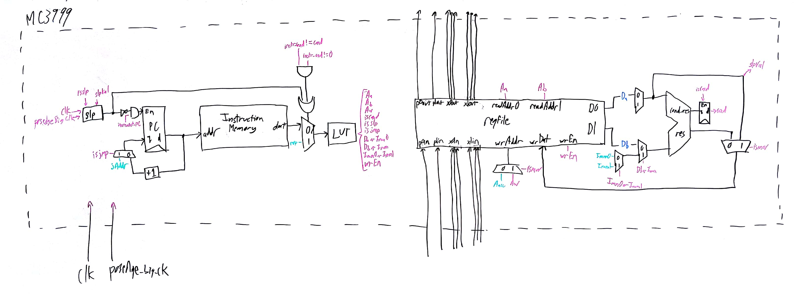

# shenzhen-io
Computer Architecture final project

A simulation of Zachtronics' [Shenzhen I/O](http://www.zachtronics.com/shenzhen-io/). Microcontrollers are simulated in Verilog and run code assembled with Python. You can view the resulting waveforms in GTKWave. We tried to match the game pretty well; how our simulation differs from [this manual](http://shenzhen-io.wikia.com/wiki/File:SHENZHEN_IO_Manual.pdf) is detailed in our design decisions, and documentation for our ISA and CPUs is available below.

In this repo, we have code for the MC3999, a processor very similar in design to the MC4000 described in the Shenzhen I/O manual. It has the same registers and same amount of program memory (9 lines), but it lacks a few of the more niche assembly commands of the MC4000. These processors are designed such that multiple chips can easily communicate with each other and with outside devices, and all of the inter-device communication present in game is present in our design.

We needed a final project for our Computer Architecture class and this seemed fun and challenging, especially exploring communication protocols.

## Required software

Our project uses the following software (downloadable at the links):

- [python3](https://www.python.org/)
  - numpy
- [Icarus Verilog](http://iverilog.icarus.com/)
- [GTKWave](http://gtkwave.sourceforge.net/)

## How to run

From inside the `verilog` folder:

```bash
./run.sh module_name asmFileName1 asmFileName2 ...
```

This assumes that all of your asm filenames are in the `assembler` folder (please do not give it the file extensions for those). the `module_name` variable can be `A`, `B`, or any the letter X in any designX.t.v test bench you write.

Currently, module A is two MC3999 modules: chip 1 x0 is connected to chip 2 x0, chip 2 p0 is connected to the output signal. Module B is one MC3999 module, with output signal connected to p0.

## Architecture
### ISA
We have an ISA for the assembly language used by the MC3999 chip, available [here](ISA.pdf). It defines the operations in the assembly language as well as how they're translated into machine code. It also specifies many of the unique operations of the MC3999 chip. Details of our python code (used primarily to assemble code to machine code) are available [here](python).

### Components


This is the highest level block diagram of one of our MC3999 microcontrollers. At its heart, the MC3999 is a single cycle CPU, with some nontraditional conditional execution, I/O registers, and sleeping behavior. The vast majority of our components are behavioral, so we don't have block diagrams for them, but descriptions of how they behave follow:

- **slp**: This module handles the microcontroller's sleeping behavior. When a sleep command is executed, the `slp` module's interior sleep counter is set to the input value. The microcontroller ceases operation (i.e. the program counter doesn't increment, and the fetched command is made into a `nop`) until the specified number of long clock cycles have passed.
- **LUT**: A fairly straightforward lookup table that takes in our machine code command and outputs all of the requisite control signals for the rest of the cycle. The definition of the table is available [here](https://docs.google.com/spreadsheets/d/1rYDHNdSZZgFAvp9TGcSAbn49Tsm6109KkL4NYZ0mMM4/edit?usp=sharing).
- **regfile**: The MC3999's collection of registers. There are three flavors of registers contained in this module:
  - Internal storage (`acc`): A standard internal storage register. The MC3999 only has one.
  - Simple I/O (`p0`, `p1`): Simple I/O ports, as defined in the ISA. Can handle values from 0 - 127. When a value is output to a simple I/O port, that value stays on that line until the corresponding input port is read from. The ports are bidirectional, so output values can exist on both sides simultaneously.
  - XBus I/O (`x0`, `x1`): XBus I/O ports, as defined in the ISA. Used primarily for inter-chip communication. Can handle values from -1024 - 1023. These are blocking I/O ports; when a chip tries to read or write from or to one of these ports, that chip's execution halts until the other chip can either write or read the data with a corresponding XBus command. Once written or read, values do not persist on the XBus lines.
- **ALU**: This is a completely behavioral ALU. It can add/subtract/multiply its two input values, and it also outputs the result of `==`, `>`, or `<` operations on its two input values, based on the `funct` input it receives.

## Design Decisions

There are several places where the behavior of our MC3999 differs from that of the processors in game:
- **Number ranges**: We changed the acceptable values for registers to make sense in binary. In game, simple I/O registers can handle numbers from 0 - 100, and XBus and internal storage registers values from -999 - 999. These numbers make sense for people, but in hardware are somewhat arbitrary constraints. To that effect, we extended these ranges to the maximum that the required registers could handle. So, simple I/O registers range from 0 - 127 (7 bits), and XBus and internal storage registers range from -1024 - 1023 (11 bits, 2's complement).
- **Conditional execution**: In game, lines that should be skipped via conditional execution are skipped over completely timing-wise; it's as if they don't even exist in program memory. We _might_ have been able to get this functionality if we did some fancy work with branching when we assembled code, but decided instead to just have lines that were skipped via conditional execution still take a clock cycle, but change the fetched instruction to a `nop`.
- **Normal/Long clock period**: In game, the actual execution of any one command by the processors is considered to be infinitely fast, and time only advances while chips are sleeping. We weren't able to get our processors to run infinitely fast, so instead we have two clocks: a normal clock, that the processors use to advance their program counter and write to their registers, and a long clock, that the processors use to count down while sleeping. We're able to choose the relative length of the long clock period, so we can, in practice, make the normal clock speed trivial by comparison.
- **XBus commands**: Chips are unable to do commands that use two XBus registers (e.g. `mov x0 x1`). Currently, we do not sync XBus behavior across multiple ports, which would prevent all three chips from synchronizing before advancing past their XBus commands. This was accidental and is at the top of our list of recommended next steps.
- **Labels**: Lines with only labels become a `nop` in machine code. This is a quirk of our compiler that could be removed, but it works in that labels in-game take up a line of memory, so having them take up a line of program memory is accurate in some ways, despite its behavior on execution being less accurate.
- **Limited command set**: We deliberately chose not to implement a few commands (e.g. `slx` and `tcp`) for the sake of time and to simplify a couple aspects of our implementation. In the case of `slx` and `tcp`, this was because we decided that the functionality of these two commands already existed in other commands (`slx` is used in-game as a power use optimization, which we don't track, and `tcp` is very rarely used and is very nearly exactly the same as `tgt`). The commands `dst` and `dgt`, however, we chose not to implement both because it would be very difficult and awkward to define their behavior in hardware, as they interact directly with the digits of the base-10 value of numbers, and because `dgt` would require the use of three registers/immediates at once, and we felt it unnecessary to warp the design of the entire processor around one rarely used command.

## Next steps

- Fix the XBus command bug described in the previous design decisions section.
- While you're at it, also clean up the XBus execution logic. The behavior of XBus registers was surprisingly difficult to get right in hardware, and the logic right now is a bit clunky, with lots of conditional statements that need inputs from *all* of the processor's XBus ports. This would make it unnecessarily difficult to add additional XBus ports, which some of the other chips in game use. There are definitely some behavioral Verilog techniques that could be used to clean everything up and make it more extensible.
- Add other chip designs. In game, there are two additional processors that we haven't implemented: one with two internal storage regsiters, two simple I/O ports, four XBus ports, and 13 lines of program memory, and one with 4 XBus ports and 9 lines of program memory.
- Implement the commands that are not yet implemented (e.g. `dst`). Some of these would be fairly straightforward (e.g. `slx`), but `dgt` would probably require some modification of the regfile and the ALU.
- Design a more intuitive interface for making connections between chips. Right now, it's a pretty clunky process to define a network of processors and their connections, to write code and load it onto specific processors, and to nicely display the relevant outputs. Of course, we don't intend for the final presentation to match that of the game's, but it'd be nice for it to be more usable.
